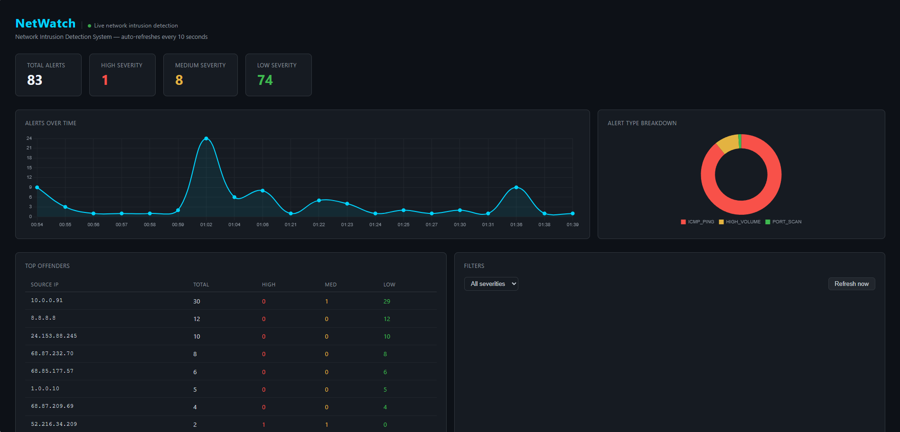

# NetWatch — Network Intrusion Detection System

A Python-based network intrusion detection system that captures live traffic, detects suspicious activity, logs alerts to a SQLite database, and displays them on a real-time Flask dashboard.



---

## Features

- Real-time packet capture using Scapy
- Detection rules: port scans (TCP and UDP), ICMP ping sweeps, high traffic volume, blacklisted IPs
- Alert logging to a local SQLite database
- Live web dashboard with severity filtering, auto-refresh every 10 seconds, and Chart.js visualizations
- Line chart showing alerts over time
- Donut chart breaking down alert types
- Top offenders table showing most active source IPs
- Color coded alert rows by severity
- JSON API endpoint for alerts

---

## Project Structure

```
netWatch/
├── main.py           # Entry point for packet capture
├── sniffer.py        # Scapy sniffing logic
├── detector.py       # Detection rules and alert logic
├── database.py       # DB connection and query functions
├── reporter.py       # Flask dashboard (NetWatch UI)
├── schema.sql        # Database schema
├── config.py         # Settings and thresholds
├── requirements.txt  # Python dependencies
└── README.md
```

---

## Setup

**1. Install dependencies**
```bash
pip install -r requirements.txt
```

**2. (Optional) Set your network interface in config.py**
```python
INTERFACE = "Wi-Fi"   # or "Ethernet", "eth0", "wlan0", etc.
```
To list available interfaces:
```bash
python -c "from scapy.all import get_if_list; print(get_if_list())"
```

---

## Running the Project

Open two terminals in the project folder.

**Terminal 1 — Packet capture (requires admin/root)**

Windows (run PowerShell as Administrator):
```bash
python main.py
```

Linux/Mac:
```bash
sudo python main.py
```

**Terminal 2 — Dashboard**
```bash
python reporter.py
```

Then open http://127.0.0.1:5000 in your browser.

---

## Simulating a Port Scan (for testing)

If you don't have nmap installed, you can trigger a PORT_SCAN alert with Python:

```bash
python -c "
import socket
target = '127.0.0.1'
for port in range(1, 101):
    try:
        s = socket.socket()
        s.settimeout(0.05)
        s.connect((target, port))
        s.close()
    except:
        pass
print('Done scanning.')
"
```

---

## Adding Blacklisted IPs

```bash
python -c "
from database import get_connection
conn = get_connection()
conn.execute(\"INSERT OR IGNORE INTO blacklist (ip_address, reason) VALUES ('203.0.113.9', 'Known scanner')\")
conn.commit()
conn.close()
print('IP added.')
"
```

---

## Detection Rules

| Alert Type    | Severity | Trigger                                          |
|---------------|----------|--------------------------------------------------|
| PORT_SCAN     | HIGH     | Single IP contacts 10+ unique ports              |
| HIGH_VOLUME   | MEDIUM   | Single IP sends 500+ packets in a session        |
| ICMP_PING     | LOW      | Any ICMP packet detected                         |
| BLACKLIST_HIT | HIGH     | Source IP matches an entry in the blacklist table |

Thresholds can be adjusted in `config.py`.

---

## Built With

- Python 3
- Scapy
- Flask
- SQLite
- Chart.js